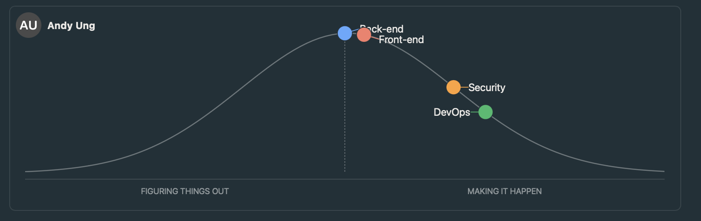
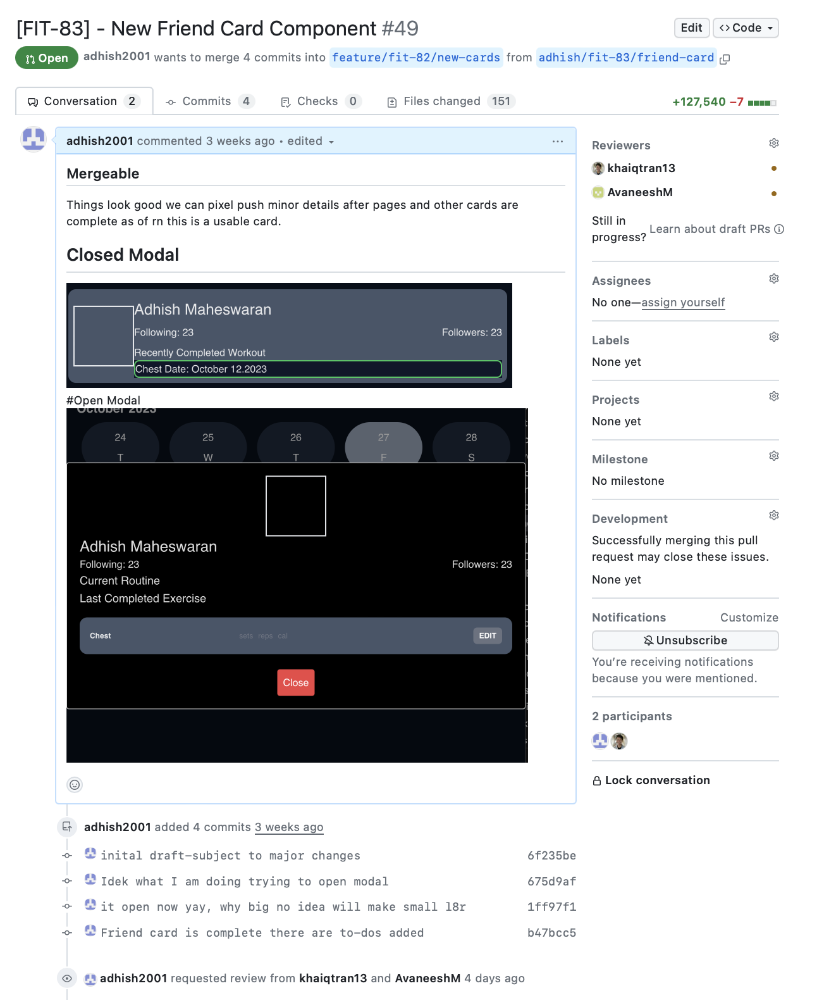

| Outline    |                             |
| ---------- | --------------------------- |
| Course     | SEG4105                     |
| Submission | Lab07                       |
| Student    | Adhish Maheswaran 300133918 |

# Stand Up

## Summary of Stand Up

Over the past week I've been working on reworking and creating new cards. I've been succesful in creating friend card that will be used for the social page. I'm currently working on reworking the exercise and workout car. As of now, I've researched and created new props and attached modals to both these cards but I still need to connect it back-end and complete formatting and styling. No blockers.

## Hill Chart Snapshot

## PR history

Link to PR: https://github.com/LukaDavid04/FitShare/pull/49

## Planned Meeting

Next meeting for sharing the stand-up will be on coming Tuesday Nov 6.
